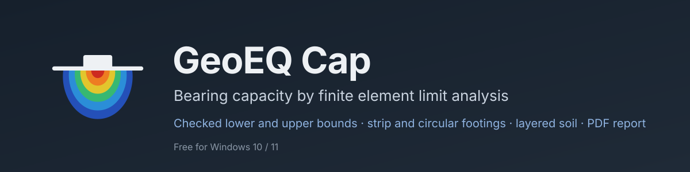
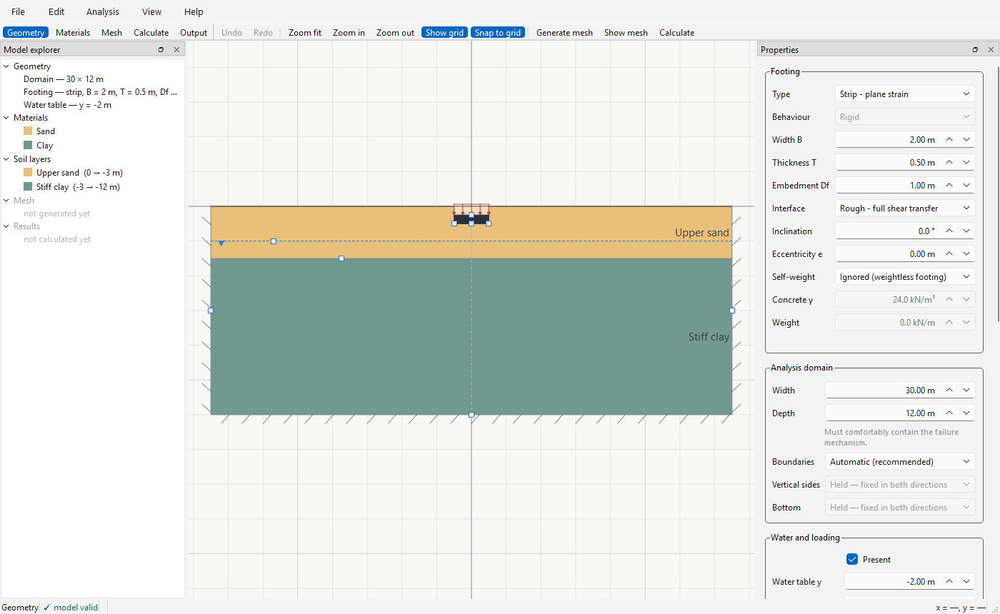
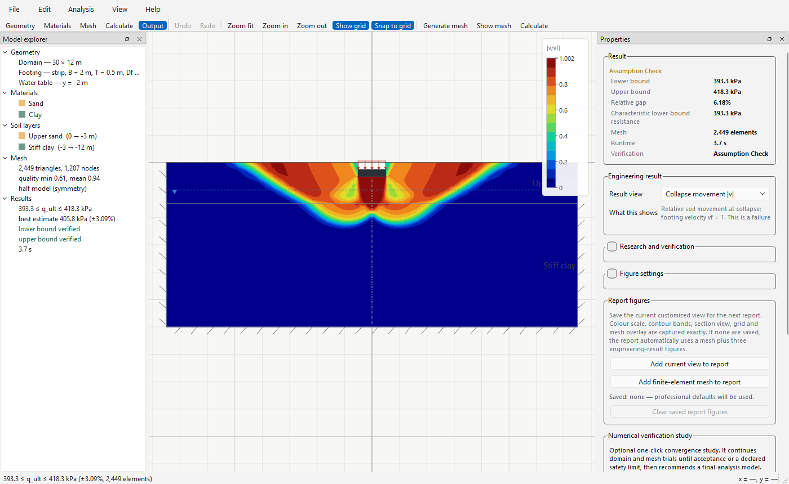
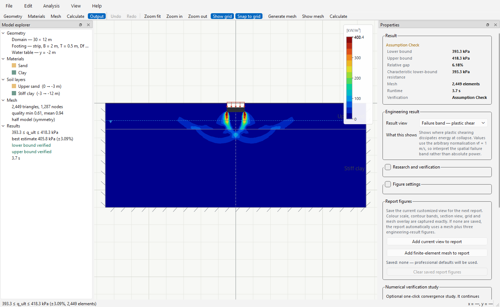
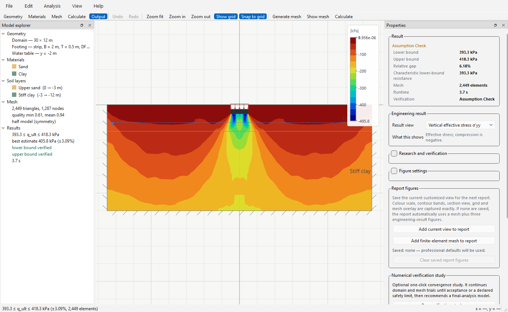
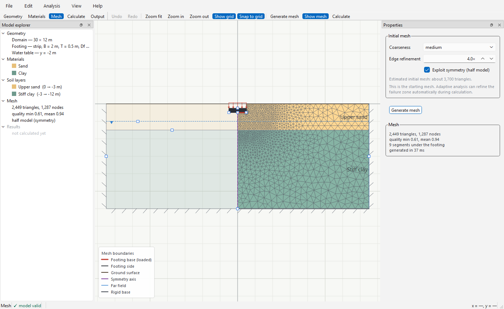

<p align="center">
  
</p>

<h1 align="center">GeoEQ Cap — Free Bearing Capacity Software</h1>

<p align="center">
  Bearing capacity of <b>strip and circular footings</b> by
  <b>finite element limit analysis</b> — checked lower and upper bounds
  on the collapse load, layered soil, groundwater, inclined and eccentric
  loads, load envelopes, and a review-ready <b>PDF calculation report</b>.
  Free geotechnical software for Windows.
</p>

<p align="center">
  <a href="https://github.com/geoeq/GeoEQ-Cap/releases/latest"></a>
  <a href="https://github.com/geoeq/GeoEQ-Cap/releases/latest"></a>
  <a href="#faq"></a>
  <a href="https://github.com/geoeq/GeoEQ-Cap/releases"></a>
  <a href="https://github.com/geoeq/GeoEQ-Cap/stargazers"></a>
</p>

<p align="center">
  <a href="#download--install">Download</a> ·
  <a href="manual/user-guide.pdf">User guide</a> ·
  <a href="#screenshots">Screenshots</a> ·
  <a href="CHANGELOG.md">Changelog</a> ·
  <a href="#faq">FAQ</a> ·
  <a href="#support--feature-requests">Support</a>
</p>

---

## Why GeoEQ Cap?

Most bearing-capacity calculations still go through the classical
formulas — Terzaghi, Meyerhof, Hansen, Vesić — with shape, depth and
inclination factors bolted on, and a spreadsheet nobody fully trusts for
layered ground or a water table under the footing. Commercial limit
analysis software solves the real problem but costs more than many
practices can justify for footings.

**GeoEQ Cap** does the real problem, for free: it meshes the soil, solves
the collapse load by finite element limit analysis, and hands you a
**lower bound and an upper bound** that the software has *checked* — not a
single number you have to take on faith.

- ✅ **Free** (version 1.x, full-featured — see [FAQ](#faq))
- ✅ **Two bounds, both verified** — equilibrium and yield are checked on
  the lower-bound field, the flow rule on the upper-bound mechanism, after
  every solve
- ✅ **Real ground** — any number of soil layers, drained or undrained, a
  water table, a surcharge, an embedded footing
- ✅ **A report a reviewer can sign** — cover page, assumptions, a
  measured-versus-limit QA checklist, figures, and every solver note on
  record
- ✅ **Your data stays yours** — plain `.geq` project files on your disk,
  works fully offline

## Screenshots

**Model** — draw the footing, the layers and the water table; the
boundary conditions are shown on the model the way you are used to:

<p align="center">
  
</p>

**Collapse mechanism** — the upper-bound velocity field after one click
on Calculate. The failure surface is where the soil actually moves:

<p align="center">
  
</p>

**Failure band** — plastic shear power concentrates the mechanism into the
slip surfaces, including the jump along the layer interface:

<p align="center">
  
</p>

**Stresses** — the lower-bound stress field, here vertical effective
stress, with the same presentation choices reviewers expect:

<p align="center">
  
</p>

**Mesh** — an unstructured triangle mesh, refined at the footing edge
where the stresses concentrate; adaptive refinement takes over during
the calculation and closes the gap between the two bounds where it
matters:

<p align="center">
  
</p>

## Features

- **Finite element limit analysis (FELA)** with Mohr–Coulomb soil: a
  lower-bound stress field and an upper-bound velocity field are solved
  as conic optimisation problems, giving an interval that brackets the
  collapse load. Both are checked independently after the solve, and
  the report says whether they passed
- **Strip and circular footings.** Strip (plane-strain) results are
  rigorous bounds. Circular footings are solved as an axisymmetric
  problem and reported as estimated (near) bounds, validated against
  the exact circular solutions in the literature — and labelled as such
- **Layered ground**: any number of layers, each with its own cohesion,
  friction angle, dilatancy and unit weights; drained or undrained.
  Slip along a layer interface is priced at the correct strength of
  each side, so a sand-over-clay profile does not get a free ride
- **Groundwater and surcharge**: water table at any depth, surface
  surcharge, embedded footings, rough or smooth base
- **Inclined and eccentric loads**, and **V–H and V–M failure
  envelopes** — sweep the load direction to trace the combinations of
  vertical load, horizontal load and moment the ground can carry
- **Adaptive mesh refinement** that concentrates elements where the
  mechanism forms and narrows the bound gap
- **Output**: collapse mechanism, failure band, velocities, stresses,
  mean stress, maximum shear, strength mobilisation and the yield
  function as filled contours; banded or smooth; full or robust colour
  range; half or whole model; mesh overlay; figure export to PNG, SVG
  and PDF
- **Comparison with conventional methods**: the FELA interval in one
  chart with the classical bearing-capacity formulas and a
  method-of-characteristics solution, with the position of each method
  relative to the interval stated
- **Calculation report as PDF**: document identity (client, document
  number, revision, prepared and checked by), a verification seal,
  numbered sections, assumptions, a QA checklist of measured values
  against their limits, figures, and an appendix with every solver note
  verbatim
- **Design formats**: present the characteristic resistance in an
  Eurocode 7 partial-factor format or convert it to LRFD / ASD values —
  always stated on the report, never hidden in a number
- **Automatic verification studies**: domain-size, mesh and layer
  studies run on copies of your project and tell you whether the answer
  is converged
- **Offline-first**: no account, no cloud dependency; automatic update
  notifications when you're online

## Download & install

1. Grab the latest Windows package from the
   **[Releases page](https://github.com/geoeq/GeoEQ-Cap/releases/latest)**
   (`GeoEQ-Cap-<version>-setup.exe` or the portable `.zip`).
2. Run the installer, or unzip anywhere and start `GeoEQ Cap.exe`.
3. Requirements: Windows 10 / 11, 64-bit. Nothing else to install.

> New here? The application opens with a complete two-layer example you
> can mesh, calculate and report straight away.

## Quick start

1. **Geometry** — set the footing width and depth, the soil layers and
   the water table. Drag on the model or type in the Properties panel.
2. **Materials** — pick from the material library or enter *c*, *φ*
   and unit weights for each layer.
3. **Mesh** — press **F9**. Choose the coarseness; adaptive refinement
   takes over from there.
4. **Calculate** — press **F5**. The application switches to the
   Output stage with the collapse mechanism on screen and the result
   card showing the lower and upper bound.
5. **Report** — *Output → Save report* writes the PDF.
   *Output → Compare* puts the interval beside the classical methods.

Full guide: **[User guide (PDF)](manual/user-guide.pdf)**.

## Updates

The app checks [`updates/latest.json`](updates/latest.json) at startup
(silently, never blocking — offline machines are unaffected) and shows
a notice bar with what the new version brings. Critical releases can be
marked required. Manifest fields:

| Field | Meaning |
|---|---|
| `version` | Latest released version — older builds show an update notice |
| `minimum_version` | Builds older than this must update (online only) |
| `download_url` | Where the notice's Download button points |
| `notes` | One-line "what you get" shown in the update notice |
| `announcements` *(optional)* | Dismissible messages for the in-app notice bar, each with an optional link and date window — see [updates/README.md](updates/README.md) |

## FAQ

**Is GeoEQ Cap really free?**
Yes — version 1.x is free and full-featured, for both commercial and
personal use.

**What is finite element limit analysis, in one paragraph?**
Instead of stepping a footing down until the soil fails (a displacement
FE analysis, which needs stiffness parameters you often don't have and a
judgement call about where "failure" is), limit analysis asks the
plasticity question directly: *what is the largest load the ground can
carry?* The **lower bound** finds a stress field that is in equilibrium
and nowhere exceeds the soil strength — so the true collapse load is at
least that. The **upper bound** finds a collapse mechanism and equates
the work done by the load to the energy dissipated in the soil — so the
true collapse load is at most that. Refine the mesh and the two bounds
close in on the answer from both sides.

**How is this different from Terzaghi / Meyerhof / Vesić?**
The classical formulas are for a footing on one uniform soil; layers,
water tables, embedment and inclination are handled with correction
factors from model tests and judgement. GeoEQ Cap solves the actual
boundary-value problem you draw. For the textbook case the two agree —
that is one of the verification benchmarks — and where they don't, the
comparison chart shows you by how much and in which direction.

**Are the results rigorous?**
For strip footings (plane strain), yes: the lower and upper bounds are
rigorous for the stated model — the soil parameters, the geometry and
the domain you chose — and the software checks each one after the solve
rather than trusting the optimiser's status. For circular footings the
axisymmetric formulation is a near-bound (as in every FELA code, this
one included), and the results are labelled that way in the application
and the report.

**Does it work offline?**
Completely. Projects are plain `.geq` files on your disk; no account or
internet needed. When you are online it checks for updates at startup.

**Which design code does it follow?**
None by itself — and that is on purpose. The solver reports the
characteristic collapse resistance of the model. The report lets you
present it in an Eurocode 7 partial-factor format or convert it to
LRFD / ASD values, and states which one was applied. Applying the
right code is the engineer's decision; the software makes it explicit.

**Will it run on macOS?**
A macOS build is planned. Watch the Releases page.

## Like it? Star and share

GeoEQ Cap v1.x is **free**. If it saves you time, two small things keep
the project growing:

- **[Star this repository](https://github.com/geoeq/GeoEQ-Cap)** —
  stars are how other engineers discover the software on GitHub.
- **Share it with a colleague** —
  [share on LinkedIn](https://www.linkedin.com/sharing/share-offsite/?url=https%3A%2F%2Fgithub.com%2Fgeoeq%2FGeoEQ-Cap)
  · [share on X](https://twitter.com/intent/tweet?text=Free%20bearing%20capacity%20software%20by%20finite%20element%20limit%20analysis%20%E2%80%94%20GeoEQ%20Cap&url=https%3A%2F%2Fgithub.com%2Fgeoeq%2FGeoEQ-Cap)
  · or simply send them this page.

## Support & feature requests

- **Found a bug?** [Start a discussion](https://github.com/geoeq/GeoEQ-Cap/discussions/new?category=q-a)
  with what you did, what happened, and the `.geq` file or a screenshot
  if possible.
- **Want a feature?** [Start a discussion](https://github.com/geoeq/GeoEQ-Cap/discussions/new?category=ideas)
  and tell us what you need and how you'd use it — upcoming versions
  are planned from these discussions.
- **Questions and how-tos** — check the **[user guide](manual/user-guide.pdf)** first,
  then ask in [Discussions](https://github.com/geoeq/GeoEQ-Cap/discussions).

## Citation

If you use GeoEQ Cap in a report, thesis, or publication, please cite it
as:

> Malo, R. C., & Qiu, T. (2026). *GeoEQ Cap* (Version 1.0.0)
> [Computer software]. GeoEQ. https://github.com/geoeq/GeoEQ-Cap

BibTeX:

```bibtex
@software{malo2026geoeqcap,
  author  = {Malo, Ripon Chandra and Qiu, Tong},
  title   = {GeoEQ Cap},
  version = {1.0.0},
  year    = {2026},
  publisher = {GeoEQ},
  url     = {https://github.com/geoeq/GeoEQ-Cap}
}
```

(You can also use GitHub's **"Cite this repository"** button, powered
by [`CITATION.cff`](CITATION.cff).)

## About GeoEQ

**[GeoEQ](https://geoeq.dev)** is a geotechnical software studio —
engineering tools that are fast, honest about their methods, and
pleasant to use. GeoEQ Cap is the second desktop release, after
[GeoEQ SPT Logs](https://github.com/geoeq/SPT-Borelogs).

---

<p align="center">
© GeoEQ · <a href="https://geoeq.dev">geoeq.dev</a> · This repository
distributes compiled builds; the source code is not published here.
Redistribution of the binaries without permission is not allowed.
</p>
